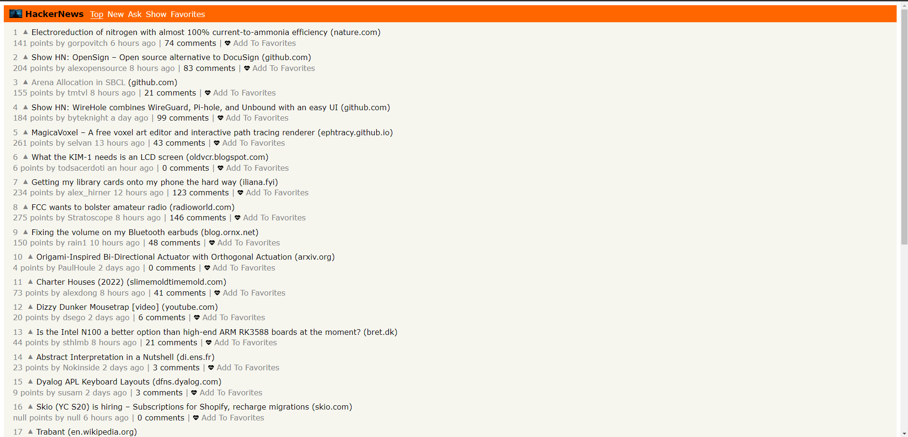
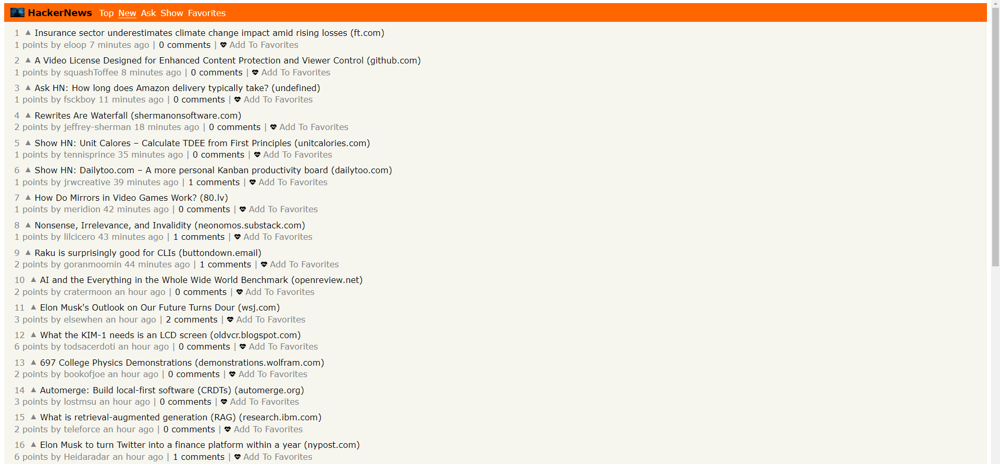
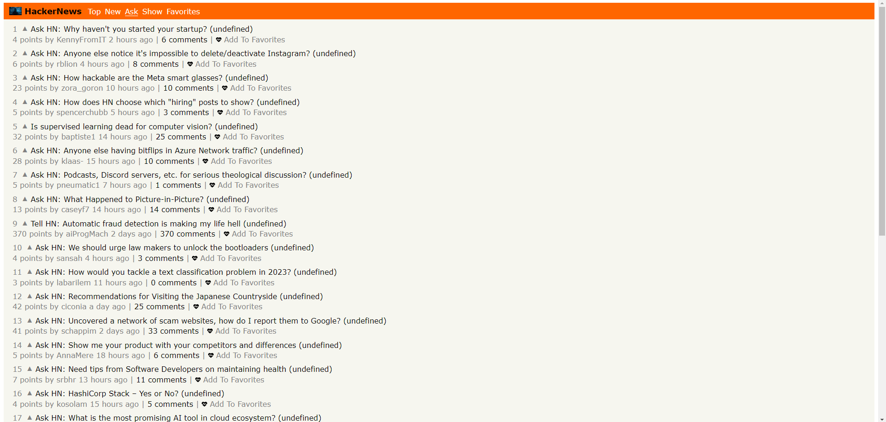
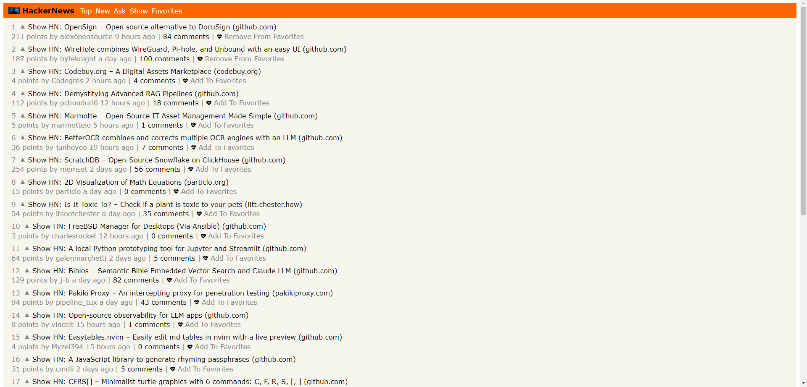
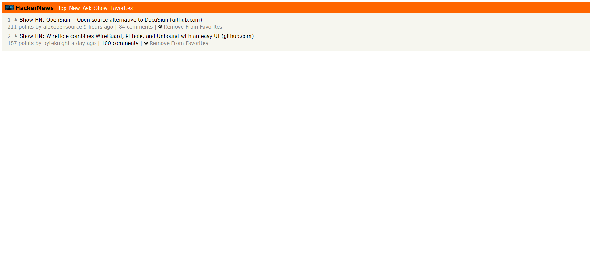

# HackerNews

> Awareness about the _Hacker News_

> https://wonderful-hacker-news.netlify.app/

Quick start:

```
$ npm install
$ npm start
```

Head over to https://vitejs.dev/ to learn more about using vite

## Screenshotes of HackerNews

1. Top
2. New
3. Ask
4. Show
5. Favorites

### _1 Top_



### _2 New_



### _3 Ask_



### _4 Show_



### _Comments_


### _5 Favorites_



## _App JS_

```
    import RouterHandler from "./router.js";

    window.onhashchange = () => {
    setActiveLink();
    };

    function setActiveLink() {
    const links = document.querySelectorAll(".header-link");
    links.forEach((link) => {
        const linkPath = link.getAttribute("href");
        const currentPath = window.location.hash;
        if (currentPath === linkPath) {
        link.classList.add("active");
        } else {
        link.classList.remove("active");
        }
    });
    }

    class App {
    constructor() {
        new RouterHandler();
    }
    }

    new App();


```

```

    import Stories from "./pages/stories.js";
    import Item from "./pages/item.js";
    import Favorites from "./pages/favorites.js";

    const router = new Navigo(null, true, "#");

    export default class RouterHandler {
    constructor() {
        this.createRoutes();
    }

    createRoutes() {
        const routes = [
        { path: "/", page: Stories },
        { path: "/new", page: Stories },
        { path: "/ask", page: Stories },
        { path: "/show", page: Stories },
        { path: "/item", page: Item },
        { path: "/favorites", page: Favorites },
        ];

        routes.forEach(({ path, page }) => {
        router
            .on(path, () => {
            page(path);
            })
            .resolve();
        });
    }
}


```
